# Force Scanner

## Сканирование портов и выявление уязвимостей

#### Специально для хакатона [Цифровой-Суверенитет.рф 3.0](https://xn----ctbbmaapfe8bebxhmwbjl2b.xn--p1ai/) от команды `git push --force`

## Запуск
1. Склонировать репозиторий и перейти в него:

    ```
    git clone https://github.com/K1rL3s/mirea-hahaton-2024.git
    cd ./mirea-hahaton-2024
    ```

2. Читать ./backend/README.md для запуска бэка
3. Читать ./frontend/README.md для запуска фронта

## Бэкенд

Занимались [Лесовой Кирилл](https://github.com/K1rL3s) и [Казаку Максим](https://github.com/TheLovii)

## Фронтенд

Занимались [Палкин Руслан](https://github.com/rusandorx) и [Перекопский Максим](https://github.com/Wo0zZ1) \
Оригинал фронта - [тут](https://github.com/rusandorx/mirea-hahaton-frontend)

## Скриншоты

<p align="center">
  <h3 align="center">
    Стартовый экран
  </h3>
  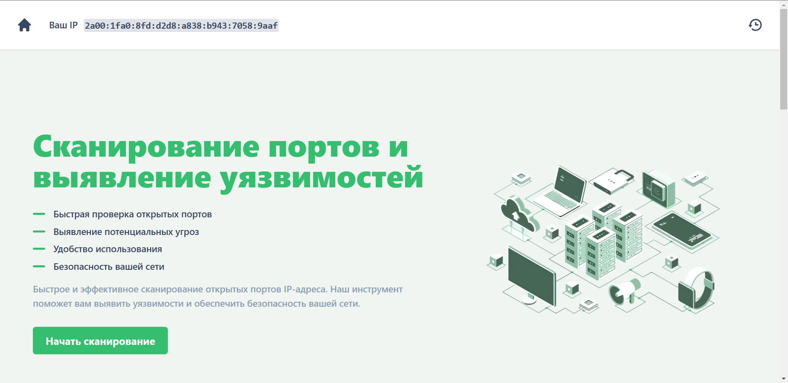
</p>

<p align="center">
  <h3 align="center">
    Последние сканирования
  </h3>
  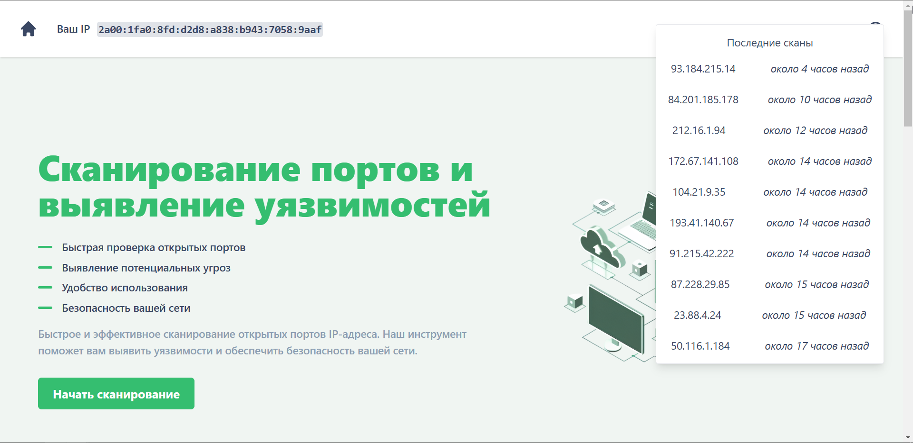
</p>

<p align="center">
  <h3 align="center">
    Инструкция
  </h3>
  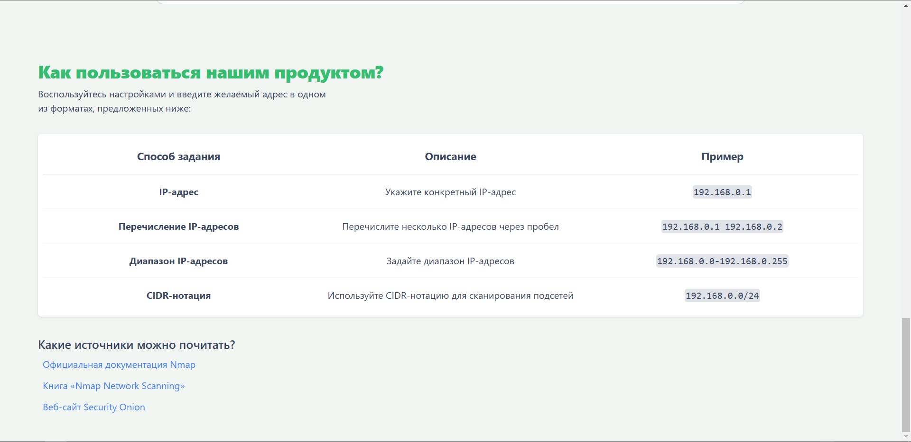
</p>

<p align="center">
  <h3 align="center">
    Домен в IP
  </h3>
  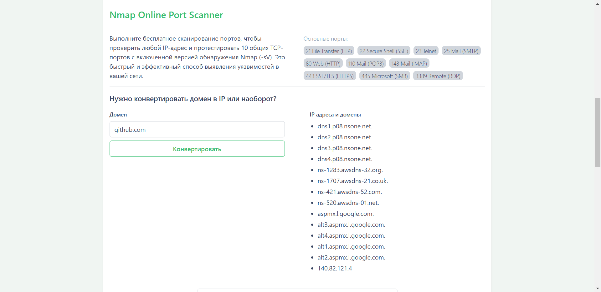
</p>

<p align="center">
  <h3 align="center">
    Варианты сканирования
  </h3>
  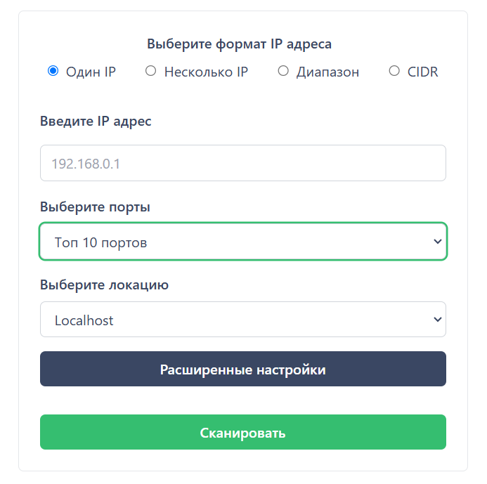
  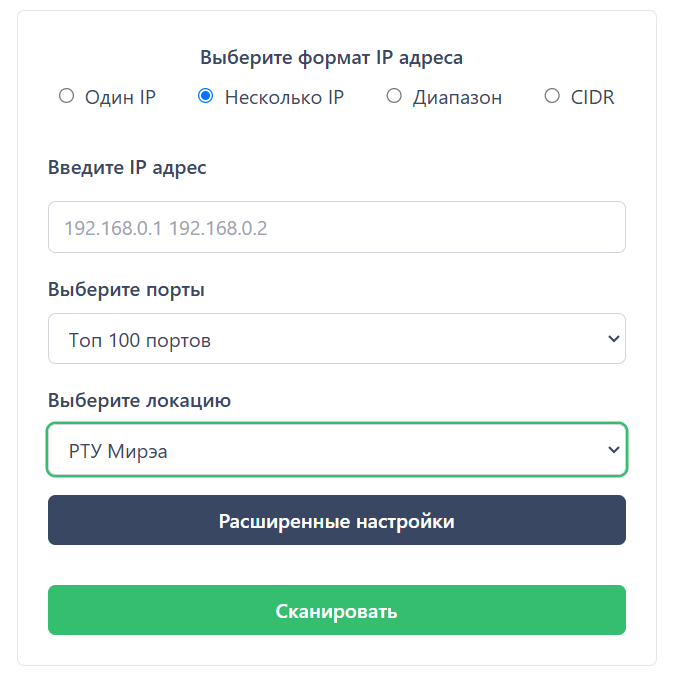
  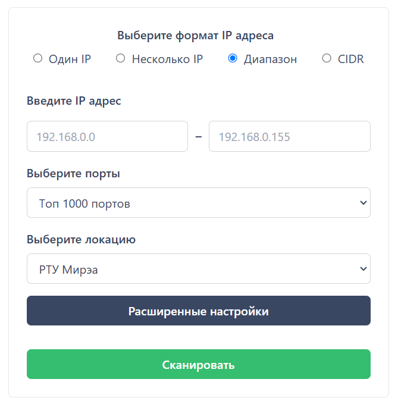
  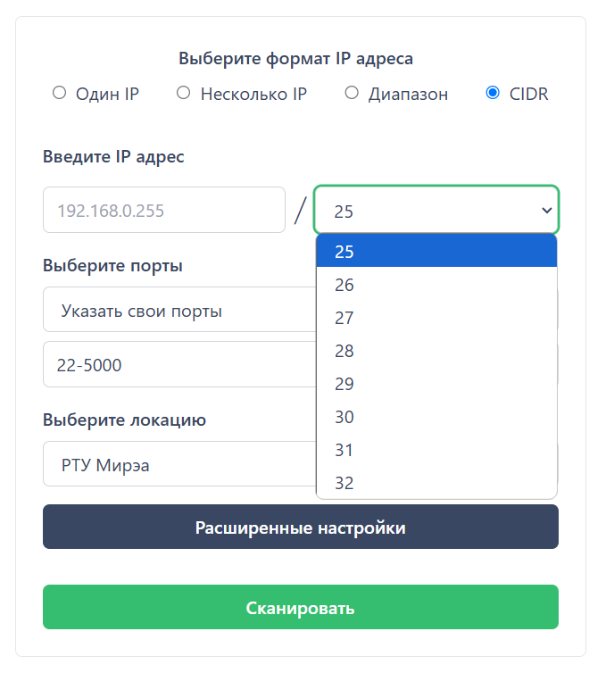
</p>

<p align="center">
  <h3 align="center">
    Расширенные настройки сканирования
  </h3>
  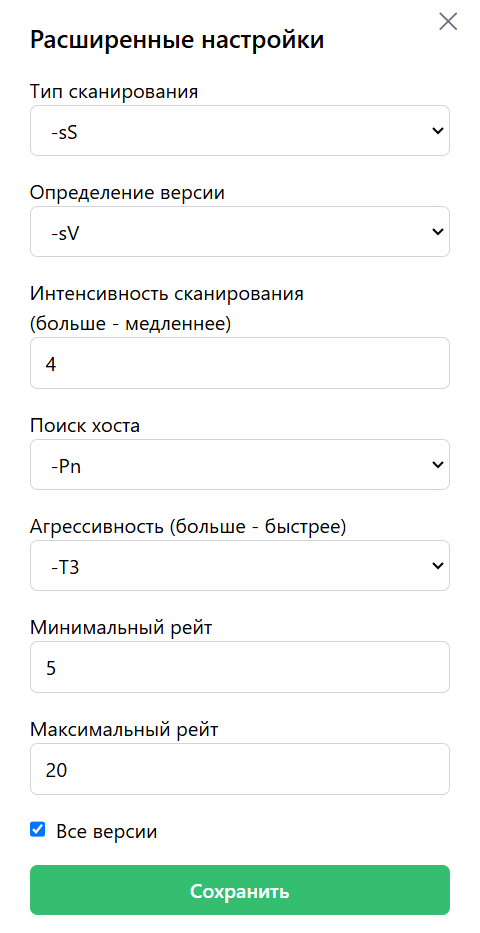
</p>

<p align="center">
  <h3 align="center">
    Результаты сканирования
  </h3>
  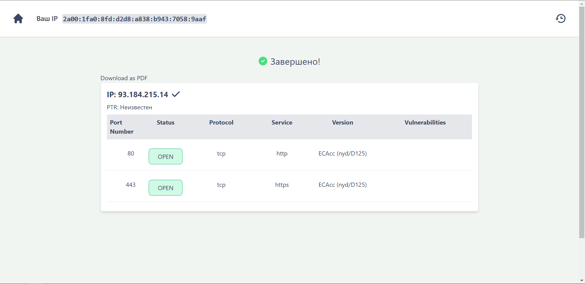
  
  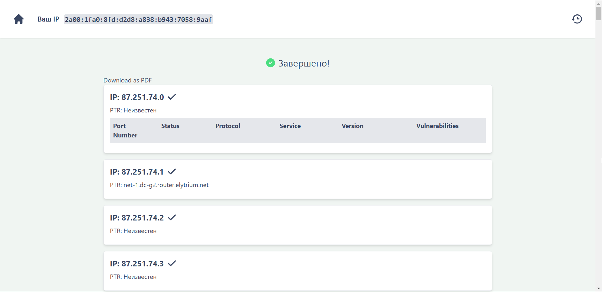
</p>

<p align="center">
  <h3 align="center">
    Сваггер
  </h3>
  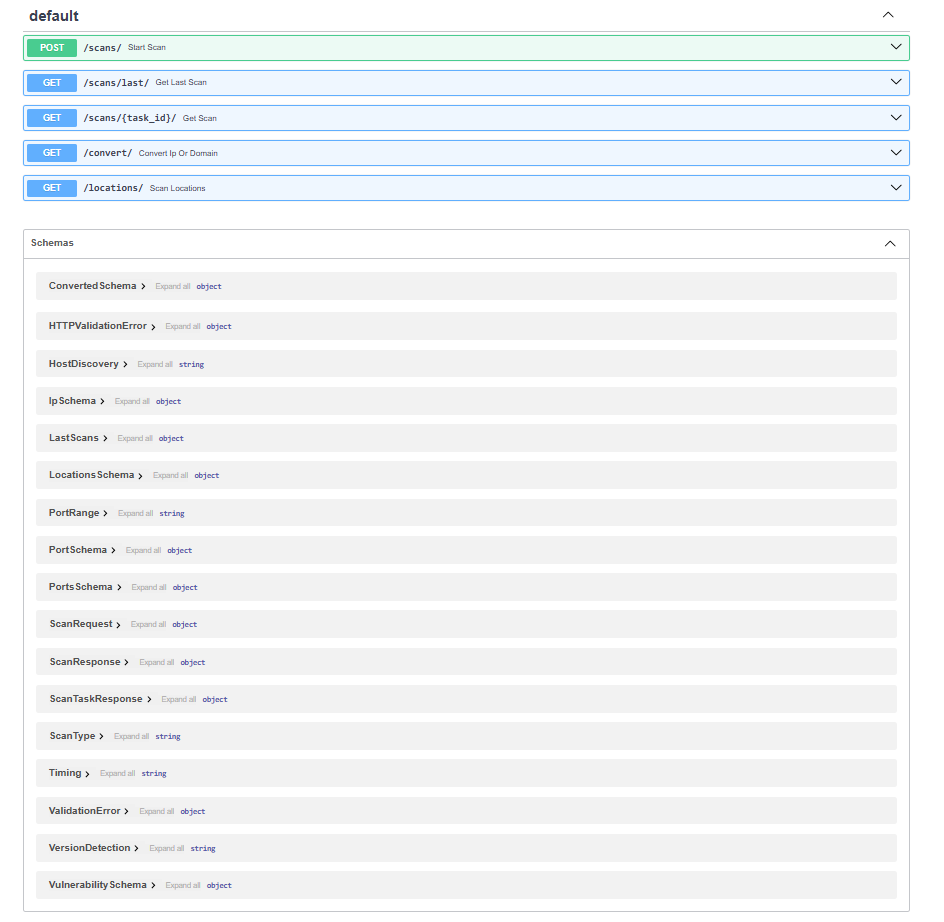
</p>

## Итоги

Взяли призёрство (2 место) среди 12-ти команд \
Нас обошла команда [инф](https://github.com/SSSR-HACKATHON-2024/asp-24)о[без](https://github.com/SSSR-HACKATHON-2024/asp-24-gui)ников :)

Спасибо организаторам хакатона и РТУ МИРЭА за невозможность <ins>во время защиты</ins> достучаться <ins>с компов жюри</ins> до лайв-демки из-за косяков внутренней сети <3

[Сам кейс](./content/СКАНИРОВАНИЕ%20ПЕРИМЕТРА%20СЕТИ.pdf)

## Лицензия

По всем вопросам: kirill.lesovoi@mail.ru

<p xmlns:cc="http://creativecommons.org/ns#" xmlns:dct="http://purl.org/dc/terms/"><a property="dct:title" rel="cc:attributionURL" href="https://github.com/K1rL3s/mirea-hahaton-2024">Force Scanner</a> by <a rel="cc:attributionURL dct:creator" property="cc:attributionName" href="https://github.com/K1rL3s/">K1rLes</a> is licensed under <a href="https://creativecommons.org/licenses/by-nc-nd/4.0/" target="_blank" rel="license noopener noreferrer" style="display:inline-block;">Creative Commons Attribution-NonCommercial-NoDerivatives 4.0 International</a></p>